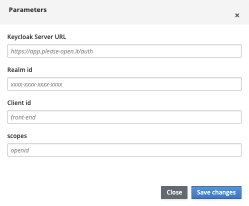

# Keycloak playground

This little app, forked from [https://github.com/sebastienblanc/keycloak-playground](https://github.com/sebastienblanc/keycloak-playground), is a simple web client for [keycloak](https://keycloak.org) openid connect server.

It uses [Javascript adapter](https://www.keycloak.org/docs/latest/securing_apps/#_javascript_adapter) from [please-open.it](https://please-open.it) servers.

## Parameters

From the "parameters" button, you can fill all parameters needed to connect this app to your Keycloak instance.

Click on "Save changes" will use the localStorage.

Also, it is possible to fill parameters by using parameters directly in the URL :

- url
- realm
- client
- scopes

**Note : this is a local application, there is no backend so you can use it to test a local Keycloak instance.**

## Set up your Keycloak

For any running Keycloak server (local, from [please-open.it](https://please-open.it) or on your own cluster, create a "playground" client with :

- redirect_uri : https://playground.please-open.it
- weborigins : https://playground.please-open.it (or "+")
